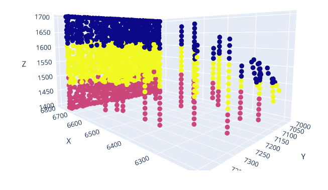

# 3DGeologicModelingAI
Solution uses graph neural networks to create 3D geological models based on solution proposed by Hillier et al 2021. 

Example output tetrahedral mesh with classified nodes:

## Repository Information

This solution is a python jupyter notebook scripted solution. It can be run on Google Colab (via Google Drive) or can be run locally within a Docker container or by installing dependencies.

To run locally, follow the Setup instructions below. The program can be run from Visual Studio Code.

## Requirements
This repo includes a Docker file, and the code can be run in a local Docker container. The container image takes care of installing all of the required libraries for the python training examples. These requirements can be found in in the Dockerfile and requirements.txt. Requirements in order to use run the solution through a Docker container:
- Visual Studio Code
- Docker Desktop installed and running: https://www.docker.com/products/docker-desktop/
- Docker Extension for Visual Studio Code: https://code.visualstudio.com/docs/containers/overview

## Setup
Steps to setup the Docker container and run the code:
1. Clone the repository
2. Open VS Code -> Button in lower right 'Open a Remote Window' -> Reopen in Container
3. If prompted: Add configurion to workspace -> From Dockerfile -> OK
4. Container image and container will be created, will take some time, then will be launched within the VS Code IDE
5. Should be prompted to install the Python Extension in the new VS Code workspace, or search and install it if not.
6. Also install the Jupyter extension into the VS Code workspace.  
7. Should now be able to run or debug the Jupyter notebook (.ipynb) files from the container workspace (F5).

Alternatively, instead of Docker, can setup a conda environment and install dependencies manually:
- Download and install anaconda: https://www.anaconda.com/anaconda-navigator
- Open Anaconda Prompt to the repo directory
- Refer to requirements.txt to create a new conda python environment and install dependencies. Make sure the correct python version is installed in the environment (python=3.10.13) to avoid dependency conflicts. Install using command 'conda install --file requirements.txt -c conda-forge'
- You should now be able to run the POC solution in VS Code (Jupyter notebook).

NOTE: Currently CUDA GPU processing does not work through the Docker deployment. This needs to be fixed. If GPU processing is desired, recommended to setup the environment manually with conda. 

## Running the Solution
- GNN_Geomodeling_Full_solution.ipynb contains the full solution end to end, in a single Jupyter notebook. This can be run locally.
- Alternatively, to run on Azure Machine Learning studio, cloud compute, run the following, in this sequence:
    1) 1_GNN_Geomodeling_Model_Prep.ipynb
    2) 2_Configure_Azure_ML.ipynb - this sends the contents in the AML subdirectory to the created cloud compute environment
    3) 3_GNN_Post_Process_Results.ipynb - this may still need touching up in order to work correctly

## When finished
Remove the docker image and container to free up utilized disc space. This can be done from the Docker extension in VS Code under 'Containers' and 'Images'.